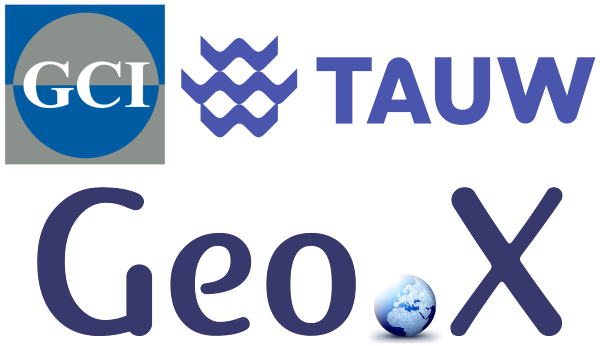

<h1 style="text-align: center;">WATER WITHOUT BORDERS</h1>

<h2 style="text-align: center;">Exploring the links between
Hydrology and Hydrogeology</h2>

<h3 style="text-align: center;">21/07/2025 - 23/07/2025</h3>

Welcome to the 20th HYDrological MODeling
Workshop (AG HydMod)! At this workshop, we bring together early-career scientists with
a water-related background and create a space to connect,
exchange ideas, and explore new perspectives. This year, our
aim is to cross the boundaries between hydrology and
hydrogeology by tackling critical interfaces such as climate
change, extreme events and pollution.

We're excited to offer you a diverse scientific and networking
programme. The workshop will feature keynote talks by
leading experts from academia and industry, interactive
discussions on interdisciplinary challenges, a poster session and
an excursion to Berlin. Beyond the science, we emphasize
networking and career development: The GFZ Career Center
will provide valuable guidance, and our keynote speakers will
share personal career journeys. To foster connections, we will
engage in group work, share meals, and enjoy informal
networking opportunities between the scientific activities and
in the evenings.

The workshop is an annual event organized by the AG
HYDMOD (Deutsche Hydrologische Gesellschaft). This year,
we are thrilled to host it at the GFZ Helmholtz Centre for
Geosciences on the historic Telegrafenberg in Potsdam. Join us
for an engaging, interdisciplinary exchange - we look forward
to welcoming you!

<h3 style="text-align: center;">We would like to thank for their contribution</h3>

    

